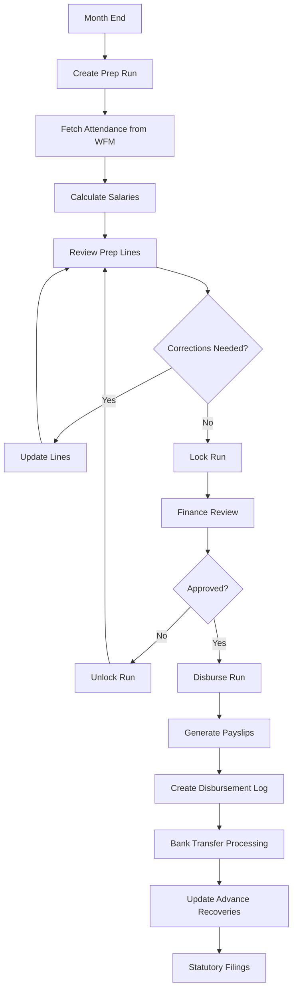
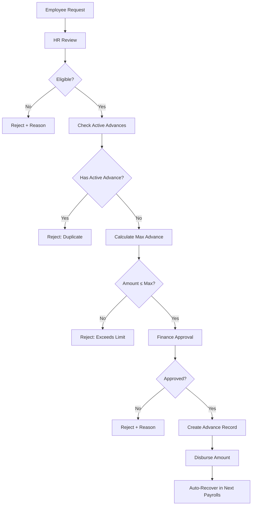
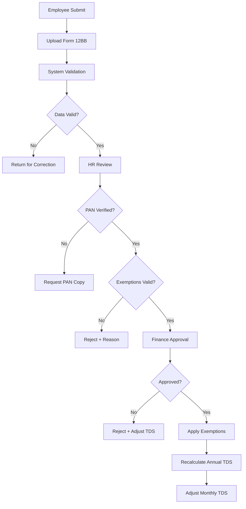

# Payroll Module - Complete Design Document

**Version**: 1.0  
**Date**: 2026-06-16  
**Status**: Production Ready  
**Module**: Payroll Management System

---

## Table of Contents

1. [Executive Summary](#executive-summary)
2. [System Architecture](#system-architecture)
3. [Database Schema](#database-schema)
4. [Core Features](#core-features)
5. [API Endpoints](#api-endpoints)
6. [Business Logic](#business-logic)
7. [Statutory Compliance](#statutory-compliance)
8. [Security & Audit](#security--audit)
9. [Integration Points](#integration-points)
10. [Workflows](#workflows)
11. [Testing Strategy](#testing-strategy)
12. [Deployment & Operations](#deployment--operations)

---

## 1. Executive Summary

### 1.1 Purpose
The Payroll module manages complete salary lifecycle: structure definition, employee assignments, monthly processing, statutory deductions (PF, ESI, TDS, PT), advances, and disbursement tracking with full audit trails.

### 1.2 Key Capabilities
- **Salary Structure Management**: Define reusable CTC templates with component breakdowns
- **Bulk Assignment**: Assign structures to employees by process/branch
- **Monthly Processing**: Generate payslips with attendance integration (WFM)
- **Statutory Compliance**: Auto-calculate PF, ESI, Professional Tax, TDS per Indian labor laws
- **Advances**: Track salary advances with auto-recovery across months
- **Governance**: Multi-stage approval workflow (draft → locked → disbursed)
- **Tax Declarations**: 80C/80D/HRA exemptions with form upload
- **Reports**: Payslips, statutory registers, MIS reports

### 1.3 Tech Stack
- **Backend**: Node.js + TypeScript + Express
- **Database**: MySQL (mas_hrms)
- **Auth**: Supabase JWT
- **Storage**: Local filesystem + MySQL BLOB for documents
- **PDF**: jsPDF for payslip generation

---

## 2. System Architecture

### 2.1 Module Structure
```
backend/src/modules/payroll/
├── payroll.service.ts           # Core business logic
├── payrollCalculate.service.ts  # Salary computation engine
├── payslip.service.ts           # PDF generation
├── taxDeclaration.service.ts    # Tax exemptions
├── payrollGaps.service.ts       # Audit gap detection
├── payroll-governance.service.ts # Approval workflow
├── payroll.controller.ts        # HTTP handlers
├── payroll.routes.ts            # Main endpoints
├── payroll-extended.routes.ts   # Advanced features
├── payroll-more.routes.ts       # Additional utilities
├── payroll.validation.ts        # Zod schemas
├── payroll.types.ts             # TypeScript interfaces
└── __tests__/
    └── calculations.test.ts     # Unit tests
```

### 2.2 Service Dependencies
```
┌─────────────────────────────────────────────┐
│           Payroll Controller                │
└────────────┬────────────────────────────────┘
             │
    ┌────────┴────────┐
    │                 │
┌───▼────────┐  ┌────▼──────────────┐
│  Payroll   │  │ Payroll Calculate │
│  Service   │  │     Service       │
└───┬────────┘  └────┬──────────────┘
    │                │
    │  ┌─────────────┴───────────────┐
    │  │                             │
┌───▼──▼────┐  ┌────────────┐  ┌────▼─────────┐
│  Payslip  │  │    Tax     │  │  Governance  │
│  Service  │  │Declaration │  │   Service    │
└───────────┘  └────────────┘  └──────────────┘
                                       │
                              ┌────────▼──────────┐
                              │  Attendance (WFM) │
                              │  Journey Log      │
                              │  Audit Log        │
                              └───────────────────┘
```

### 2.3 Data Flow
```
1. Structure Setup → Define salary components & percentages
2. Assignment      → Link structure to employees with CTC
3. Monthly Prep    → Fetch attendance → Calculate net salary
4. Approval        → Draft → Locked (reviewable) → Disbursed
5. Payslip Gen     → PDF with detailed breakdown
6. Tax Filing      → IT declarations → exemption processing
```

---

## 3. Database Schema

### 3.1 Core Tables

#### `salary_structure_master`
Reusable salary templates defining CTC breakdown.
```sql
CREATE TABLE salary_structure_master (
  id CHAR(36) PRIMARY KEY,
  structure_code VARCHAR(50) UNIQUE NOT NULL,
  structure_name VARCHAR(100) NOT NULL,
  description TEXT,
  basic_pct DECIMAL(5,2) DEFAULT 40.00,  -- % of gross for Basic
  hra_pct DECIMAL(5,2) DEFAULT 20.00,    -- % of gross for HRA
  active_status TINYINT DEFAULT 1,
  created_at TIMESTAMP DEFAULT CURRENT_TIMESTAMP,
  updated_at TIMESTAMP DEFAULT CURRENT_TIMESTAMP ON UPDATE CURRENT_TIMESTAMP,
  INDEX idx_structure_code (structure_code),
  INDEX idx_active (active_status)
);
```
**Business Rules**:
- `basic_pct` default: 40% (statutory PF/gratuity base)
- `hra_pct` default: 20% (metro: 50% of Basic, non-metro: 40%)
- Inactive structures can't be assigned to new employees

#### `employee_salary_assignment`
Links employees to structures with effective dates.
```sql
CREATE TABLE employee_salary_assignment (
  id CHAR(36) PRIMARY KEY,
  employee_id CHAR(36) NOT NULL,
  structure_id CHAR(36) NOT NULL,
  ctc_annual DECIMAL(12,2) NOT NULL,     -- Annual gross CTC
  effective_from DATE NOT NULL,
  effective_to DATE DEFAULT NULL,        -- NULL = currently active
  active_status TINYINT DEFAULT 1,
  created_at TIMESTAMP DEFAULT CURRENT_TIMESTAMP,
  FOREIGN KEY (employee_id) REFERENCES employees(id) ON DELETE CASCADE,
  FOREIGN KEY (structure_id) REFERENCES salary_structure_master(id),
  INDEX idx_employee (employee_id),
  INDEX idx_active_assignment (employee_id, active_status, effective_from)
);
```
**Business Rules**:
- Only 1 active assignment per employee (`active_status=1`)
- Historical records kept with `effective_to` set
- CTC changes trigger new assignment row

#### `salary_component_master`
Master list of salary components (earning/deduction).
```sql
CREATE TABLE salary_component_master (
  id CHAR(36) PRIMARY KEY,
  component_code VARCHAR(50) UNIQUE NOT NULL,
  component_name VARCHAR(100) NOT NULL,
  component_type ENUM('earning', 'deduction', 'statutory') NOT NULL,
  taxable TINYINT DEFAULT 1,             -- 1=taxable, 0=exempt
  active_status TINYINT DEFAULT 1,
  created_at TIMESTAMP DEFAULT CURRENT_TIMESTAMP,
  INDEX idx_component_code (component_code),
  INDEX idx_type (component_type)
);

-- Standard components
INSERT INTO salary_component_master (id, component_code, component_name, component_type, taxable) VALUES
(UUID(), 'BASIC', 'Basic Salary', 'earning', 1),
(UUID(), 'HRA', 'House Rent Allowance', 'earning', 1),
(UUID(), 'SPECIAL_ALLOW', 'Special Allowance', 'earning', 1),
(UUID(), 'PF_EMP', 'PF Employee', 'statutory', 0),
(UUID(), 'ESIC_EMP', 'ESI Employee', 'statutory', 0),
(UUID(), 'PT', 'Professional Tax', 'statutory', 0),
(UUID(), 'TDS', 'Tax Deducted at Source', 'statutory', 0),
(UUID(), 'SALARY_ADV', 'Salary Advance Recovery', 'deduction', 0);
```

#### `salary_prep_run`
Monthly payroll processing batch.
```sql
CREATE TABLE salary_prep_run (
  id CHAR(36) PRIMARY KEY,
  run_month DATE NOT NULL,               -- YYYY-MM-01
  branch_filter CHAR(36) DEFAULT NULL,   -- NULL = all branches
  process_filter CHAR(36) DEFAULT NULL,  -- NULL = all processes
  status ENUM('draft', 'locked', 'disbursed') DEFAULT 'draft',
  total_employees INT DEFAULT 0,
  total_gross DECIMAL(15,2) DEFAULT 0,
  total_deductions DECIMAL(15,2) DEFAULT 0,
  total_net DECIMAL(15,2) DEFAULT 0,
  created_by CHAR(36),
  approved_by CHAR(36) DEFAULT NULL,
  approved_at TIMESTAMP DEFAULT NULL,
  disbursed_by CHAR(36) DEFAULT NULL,
  disbursed_at TIMESTAMP DEFAULT NULL,
  created_at TIMESTAMP DEFAULT CURRENT_TIMESTAMP,
  updated_at TIMESTAMP DEFAULT CURRENT_TIMESTAMP ON UPDATE CURRENT_TIMESTAMP,
  UNIQUE KEY idx_run_month_filter (run_month, branch_filter, process_filter),
  INDEX idx_status (status),
  INDEX idx_run_month (run_month)
);
```
**Status Workflow**:
1. **draft**: Editable, can recalculate
2. **locked**: Read-only for review, reversible
3. **disbursed**: Final, triggers salary_disbursement_log

#### `salary_prep_line`
Individual employee payslip details.
```sql
CREATE TABLE salary_prep_line (
  id CHAR(36) PRIMARY KEY,
  run_id CHAR(36) NOT NULL,
  employee_id CHAR(36) NOT NULL,
  employee_code VARCHAR(50),
  -- Attendance data (from WFM)
  working_days DECIMAL(5,2) DEFAULT 0,
  present_days DECIMAL(5,2) DEFAULT 0,
  leave_days DECIMAL(5,2) DEFAULT 0,
  lwp_days DECIMAL(5,2) DEFAULT 0,      -- Loss of Pay
  late_marks INT DEFAULT 0,
  dialer_hours DECIMAL(8,2) DEFAULT 0,  -- Call center: bonus eligibility
  overtime_hours DECIMAL(8,2) DEFAULT 0,  -- Overtime hours (WFM team only)
  overtime_amount DECIMAL(10,2) DEFAULT 0,  -- Overtime payment (WFM team only)
  -- Earnings
  gross_salary DECIMAL(12,2) NOT NULL,
  basic DECIMAL(12,2) DEFAULT 0,
  hra DECIMAL(12,2) DEFAULT 0,
  special_allowance DECIMAL(12,2) DEFAULT 0,
  variable_allowances JSON DEFAULT NULL, -- [{"name": "Night Shift", "amount": 2000}]
  -- Deductions
  pf_employee DECIMAL(10,2) DEFAULT 0,
  pf_employer DECIMAL(10,2) DEFAULT 0,   -- Employer share (not deducted)
  esic_employee DECIMAL(10,2) DEFAULT 0,
  esic_employer DECIMAL(10,2) DEFAULT 0,
  professional_tax DECIMAL(10,2) DEFAULT 0,
  tds DECIMAL(10,2) DEFAULT 0,
  advance_recovery DECIMAL(10,2) DEFAULT 0,
  total_deductions DECIMAL(12,2) DEFAULT 0,
  net_salary DECIMAL(12,2) NOT NULL,
  -- Audit
  remarks TEXT,
  status ENUM('pending', 'processed', 'approved', 'paid') DEFAULT 'processed',
  created_at TIMESTAMP DEFAULT CURRENT_TIMESTAMP,
  updated_at TIMESTAMP DEFAULT CURRENT_TIMESTAMP ON UPDATE CURRENT_TIMESTAMP,
  FOREIGN KEY (run_id) REFERENCES salary_prep_run(id) ON DELETE CASCADE,
  FOREIGN KEY (employee_id) REFERENCES employees(id),
  INDEX idx_run_employee (run_id, employee_id),
  INDEX idx_employee (employee_id),
  INDEX idx_status (status)
);
```

#### `salary_advance`
Employee loan tracking with auto-recovery.
```sql
CREATE TABLE salary_advance (
  id CHAR(36) PRIMARY KEY,
  employee_id CHAR(36) NOT NULL,
  advance_date DATE NOT NULL,
  amount DECIMAL(10,2) NOT NULL,
  recovery_months INT NOT NULL,          -- Installments
  recovered_amount DECIMAL(10,2) DEFAULT 0,
  status ENUM('active', 'recovered', 'cancelled') DEFAULT 'active',
  notes TEXT,
  approved_by CHAR(36),
  created_at TIMESTAMP DEFAULT CURRENT_TIMESTAMP,
  updated_at TIMESTAMP DEFAULT CURRENT_TIMESTAMP ON UPDATE CURRENT_TIMESTAMP,
  FOREIGN KEY (employee_id) REFERENCES employees(id) ON DELETE CASCADE,
  INDEX idx_employee_status (employee_id, status),
  INDEX idx_advance_date (advance_date)
);
```
**Recovery Logic**:
- Monthly deduction = `(amount - recovered_amount) / remaining_months`
- Updates `recovered_amount` after each payroll run
- Status → `recovered` when `recovered_amount >= amount`

#### `tax_declaration`
Employee IT declarations (80C, HRA, etc.).
```sql
CREATE TABLE tax_declaration (
  id CHAR(36) PRIMARY KEY,
  employee_id CHAR(36) NOT NULL,
  financial_year VARCHAR(10) NOT NULL,   -- 'FY2025-26'
  section_80c DECIMAL(10,2) DEFAULT 0,   -- Max ₹1.5L
  section_80d DECIMAL(10,2) DEFAULT 0,   -- Health insurance
  hra_exemption DECIMAL(10,2) DEFAULT 0,
  rent_paid_monthly DECIMAL(10,2) DEFAULT 0,
  form12bb_path VARCHAR(500),            -- Uploaded PDF path
  pan_number VARCHAR(20),
  status ENUM('draft', 'submitted', 'approved', 'rejected') DEFAULT 'draft',
  submitted_at TIMESTAMP DEFAULT NULL,
  approved_by CHAR(36) DEFAULT NULL,
  approved_at TIMESTAMP DEFAULT NULL,
  rejection_reason TEXT,
  created_at TIMESTAMP DEFAULT CURRENT_TIMESTAMP,
  updated_at TIMESTAMP DEFAULT CURRENT_TIMESTAMP ON UPDATE CURRENT_TIMESTAMP,
  FOREIGN KEY (employee_id) REFERENCES employees(id) ON DELETE CASCADE,
  UNIQUE KEY idx_employee_fy (employee_id, financial_year),
  INDEX idx_status (status)
);
```

#### `salary_disbursement_log`
Bank transfer tracking.
```sql
CREATE TABLE salary_disbursement_log (
  id CHAR(36) PRIMARY KEY,
  run_id CHAR(36) NOT NULL,
  employee_id CHAR(36) NOT NULL,
  net_salary DECIMAL(12,2) NOT NULL,
  bank_account VARCHAR(50),
  ifsc_code VARCHAR(20),
  transaction_ref VARCHAR(100),
  disbursed_at TIMESTAMP NOT NULL,
  disbursed_by CHAR(36),
  status ENUM('pending', 'success', 'failed') DEFAULT 'pending',
  failure_reason TEXT,
  created_at TIMESTAMP DEFAULT CURRENT_TIMESTAMP,
  FOREIGN KEY (run_id) REFERENCES salary_prep_run(id),
  FOREIGN KEY (employee_id) REFERENCES employees(id),
  INDEX idx_run (run_id),
  INDEX idx_employee (employee_id),
  INDEX idx_status (status)
);
```

### 3.2 Indexes & Performance
```sql
-- Composite index for active salary lookup
CREATE INDEX idx_active_salary ON employee_salary_assignment(employee_id, active_status, effective_from);

-- Month-wise payroll query optimization
CREATE INDEX idx_prep_run_month ON salary_prep_run(run_month, status);

-- Employee payslip history
CREATE INDEX idx_prep_line_emp_run ON salary_prep_line(employee_id, run_id);

-- Advance recovery tracking
CREATE INDEX idx_advance_active ON salary_advance(employee_id, status) WHERE status = 'active';
```

---

## 4. Core Features

### 4.1 Salary Structure Management

#### Create Structure
```typescript
POST /api/payroll/structures
{
  "structureCode": "STD-40-20",
  "structureName": "Standard CTC (40% Basic, 20% HRA)",
  "description": "Default structure for regular employees",
  "basicPct": 40,
  "hraPct": 20
}
```
**Validation**:
- Unique `structureCode`
- `basicPct + hraPct ≤ 100`
- Minimum Basic: 40% (PF compliance)

#### List Structures
```typescript
GET /api/payroll/structures
Response: SalaryStructure[]
```

#### Bulk Assign Structure
```typescript
POST /api/payroll/assign-salary
{
  "structureId": "uuid",
  "ctcAnnual": 600000,        // ₹6L annual CTC
  "effectiveFrom": "2026-01-01",
  "processId": "uuid",        // Optional: assign to specific process
  "branchId": "uuid"          // Optional: assign to specific branch
}
Response: { assigned: 120, skipped: 5 }
```
**Process**:
1. Fetch employees matching `processId`/`branchId` filters
2. Deactivate existing assignments (`active_status=0`)
3. Insert new assignments with `effectiveFrom` date
4. Log to `journey_log` for each employee

### 4.2 Monthly Payroll Processing

#### Create Prep Run
```typescript
POST /api/payroll/runs
{
  "runMonth": "2026-06-01",
  "branchFilter": "uuid",     // Optional
  "processFilter": "uuid"     // Optional
}
Response: SalaryPrepRun
```
**Steps**:
1. Create run with status='draft'
2. Fetch employees matching filters
3. For each employee:
   - Get active salary assignment
   - Fetch attendance from WFM (`working_days`, `present_days`, `lwp_days`)
   - Calculate net salary (see §4.3)
   - Insert `salary_prep_line`
4. Update run totals

#### Get Run Details
```typescript
GET /api/payroll/runs/:runId
Response: {
  run: SalaryPrepRun,
  lines: SalaryPrepLine[],
  allowanceBreakdown: { lineId: { name: string, amount: number }[] }
}
```

#### Update Prep Line
```typescript
PATCH /api/payroll/runs/:runId/lines/:lineId
{
  "presentDays": 28,
  "lwpDays": 2,
  "remarks": "Medical leave extended"
}
```
**Constraints**:
- Only allowed if run status = 'draft'
- Auto-recalculates net salary after update

#### Delete Run
```typescript
DELETE /api/payroll/runs/:runId
```
**Constraints**:
- Only if status = 'draft'
- Cascade deletes all `salary_prep_line` records

### 4.3 Salary Calculation Engine

#### Formula (per payrollCalculate.service.ts)
```typescript
export function calculateNetSalary(params: NetSalaryParams): NetSalaryResult {
  const { grossMonthlyCTC, workingDays, lwpDays, basicPct, hraPct } = params;

  // 1. Pro-rata gross for LWP days
  const actualGross = grossMonthlyCTC * ((workingDays - lwpDays) / workingDays);

  // 2. Component breakdown
  const basic = actualGross * (basicPct / 100);
  const hra = actualGross * (hraPct / 100);
  const specialAllowance = actualGross - basic - hra;
  const allowancesTotal = params.allowances?.reduce((sum, a) => sum + a.amount, 0) || 0;
  const grossSalary = actualGross + allowancesTotal;

  // 3. Statutory deductions
  const pfBase = Math.min(basic, params.pfWageLimit);  // Capped at ₹15,000
  const pf_employee = pfBase * (params.pfEmployeePct / 100);      // 12% of pfBase
  const pf_employer_epf = pfBase * 0.0367;                        // 3.67%
  const pf_employer_eps = Math.min(basic, 15000) * 0.0833;        // 8.33% (EPS ceiling)
  const pf_employer = pf_employer_epf + pf_employer_eps;

  const esic_employee = (grossSalary <= params.esicWageLimit) 
    ? grossSalary * (params.esicEmployeePct / 100)  // 0.75%
    : 0;
  const esic_employer = (grossSalary <= params.esicWageLimit)
    ? grossSalary * 0.0325                          // 3.25%
    : 0;

  const professional_tax = params.professionalTax;  // State-dependent
  const tds = params.tds;                           // From IT projection

  // 4. Employer costs (CTC but not deducted from employee)
  const gratuity = basic * 0.0481;                  // 4.81% of Basic
  const ctc_monthly = grossSalary + pf_employer + esic_employer + gratuity;

  // 5. Net salary
  const total_deductions = pf_employee + esic_employee + professional_tax + tds;
  const net_salary = grossSalary - total_deductions;

  return {
    basic, hra, special_allowance: specialAllowance,
    allowances: params.allowances || [],
    allowances_total: allowancesTotal,
    gross_salary: grossSalary,
    pf_employee, esic_employee, professional_tax, tds,
    total_deductions, net_salary,
    pf_employer, pf_employer_epf, pf_employer_eps,
    esic_employer, gratuity, ctc_monthly
  };
}
```

#### Statutory Limits (2025-26)
| Component | Threshold | Rate |
|-----------|-----------|------|
| PF Wage Ceiling | ₹15,000 | Employee: 12%, Employer: 12% (3.67% EPF + 8.33% EPS) |
| ESI Wage Ceiling | ₹21,000 | Employee: 0.75%, Employer: 3.25% |
| Professional Tax | State-specific | Maharashtra: ₹200/month (salary > ₹10k) |
| Gratuity | No ceiling | 4.81% of Basic (15 days per year formula) |

### 4.4 Salary Advances

#### Request Advance
```typescript
POST /api/payroll/advances
{
  "employeeId": "uuid",
  "advanceDate": "2026-06-01",
  "amount": 50000,
  "recoveryMonths": 10,
  "notes": "Medical emergency"
}
```
**Rules**:
- Max advance: 2 months' gross salary
- Min recovery period: 3 months
- Only 1 active advance per employee

#### Auto-Recovery
During payroll run, for each employee:
```typescript
const activeAdvances = await getActiveAdvances(employeeId);
for (const adv of activeAdvances) {
  const remainingMonths = adv.recovery_months - Math.ceil(adv.recovered_amount / (adv.amount / adv.recovery_months));
  const monthlyDeduction = (adv.amount - adv.recovered_amount) / remainingMonths;
  
  // Deduct from net salary
  prepLine.advance_recovery = monthlyDeduction;
  prepLine.net_salary -= monthlyDeduction;
  
  // Update advance record
  adv.recovered_amount += monthlyDeduction;
  if (adv.recovered_amount >= adv.amount) {
    adv.status = 'recovered';
  }
}
```

### 4.5 Payslip Generation

#### Generate Payslip PDF
```typescript
GET /api/payroll/payslip/:lineId
Response: PDF buffer (Content-Type: application/pdf)
```

#### Payslip Layout
```
┌─────────────────────────────────────────────────────────┐
│               MAS HRMS PAYSLIP - JUNE 2026             │
├─────────────────────────────────────────────────────────┤
│ Employee: Shuvam Giri (EMP001)                          │
│ Designation: Senior Developer                           │
│ Department: Engineering | Branch: Bangalore             │
│ PAN: ABCDE1234F | Bank: HDFC ****5678                  │
├─────────────────────────────────────────────────────────┤
│ EARNINGS                           AMOUNT               │
│ Basic Salary                       ₹20,000              │
│ House Rent Allowance               ₹10,000              │
│ Special Allowance                  ₹20,000              │
│ Night Shift Allowance              ₹2,000               │
│ ─────────────────────────────────────────               │
│ Gross Salary                       ₹52,000              │
├─────────────────────────────────────────────────────────┤
│ DEDUCTIONS                                              │
│ Provident Fund (Employee)          ₹1,800               │
│ ESI (Employee)                     ₹390                 │
│ Professional Tax                   ₹200                 │
│ TDS                                ₹1,500               │
│ Salary Advance Recovery            ₹5,000               │
│ ─────────────────────────────────────────               │
│ Total Deductions                   ₹8,890               │
├─────────────────────────────────────────────────────────┤
│ NET SALARY                         ₹43,110              │
├─────────────────────────────────────────────────────────┤
│ Attendance: Present: 28 | LWP: 0 | Leave: 2            │
│ Working Days: 30                                        │
├─────────────────────────────────────────────────────────┤
│ Employer Contributions (Not Deducted):                  │
│ PF (Employer): ₹1,800 | ESI (Employer): ₹1,690         │
│ Gratuity: ₹962                                          │
├─────────────────────────────────────────────────────────┤
│ This is a system-generated payslip.                     │
│ Generated on: 2026-06-05 14:30 IST                      │
└─────────────────────────────────────────────────────────┘
```

### 4.6 Overtime Management (WFM-Only)

#### Update Overtime
**Endpoint**: `PATCH /api/payroll/lines/:lineId/overtime`

**Access Control**: 
- Only WFM team members assigned to the employee's branch
- Admin users have full access
- Middleware validates branch assignment before allowing updates

**Request**:
```typescript
PATCH /api/payroll/lines/:lineId/overtime
Authorization: Bearer <jwt-token>
{
  "overtimeHours": 15.5,
  "overtimeAmount": 3875
}
```

**Validation**:
- Run must be in `draft` status (not `locked` or `disbursed`)
- `overtimeHours`: 0-200 (max 200 hours per month)
- `overtimeAmount`: ≥ 0
- User must have WFM role for the employee's branch

**Process**:
1. Verify run is editable (not locked/disbursed)
2. Check user has WFM role for employee's branch (via `scope_assignments`)
3. Update overtime fields in `salary_prep_line`
4. Adjust gross_salary: `gross_salary = gross_salary - old_overtime_amount + new_overtime_amount`
5. Adjust net_salary: `net_salary = net_salary - old_overtime_amount + new_overtime_amount`
6. Log sensitive action (audit trail)
7. Append journey event to employee record

**Calculation Impact**:
- Overtime amount is added to gross salary
- Overtime is **fully taxable** (included in TDS calculation)
- PF/ESI calculations remain based on base salary components (not overtime)
- Overtime shows as separate line item in payslip

**Audit Trail**:
```json
{
  "action": "payroll.overtime.update",
  "resourceType": "salary_prep_line",
  "resourceId": "line-uuid-123",
  "metadata": {
    "employeeCode": "EMP001",
    "branchId": "branch-uuid-456",
    "overtimeHours": 15.5,
    "overtimeAmount": 3875
  }
}
```

**Journey Log**:
```json
{
  "eventType": "overtime_updated",
  "eventCategory": "payroll",
  "description": "Overtime updated: 15.5h = ₹3875",
  "metadata": {
    "lineId": "line-uuid-123",
    "overtimeHours": 15.5,
    "overtimeAmount": 3875,
    "updatedBy": "wfm-user-uuid"
  }
}
```

**Response**:
```typescript
{
  "success": true,
  "data": {
    "id": "line-uuid-123",
    "employee_id": "emp-uuid",
    "overtime_hours": 15.5,
    "overtime_amount": 3875,
    "gross_salary": 55875,  // Base 52000 + OT 3875
    "net_salary": 46985,    // Adjusted with OT
    // ... other fields
  }
}
```

**Error Scenarios**:
| Error | Status | Message |
|-------|--------|---------|
| Run locked/disbursed | 400 | "Cannot update overtime: run is locked" |
| No WFM role for branch | 403 | "Access denied: Only WFM team members can update overtime for this branch" |
| Line not found | 404 | "Payroll line not found" |
| Invalid hours/amount | 400 | Zod validation error |

### 4.7 Approval Workflow

#### Lock Run
```typescript
POST /api/payroll/runs/:runId/lock
Effect: status='draft' → 'locked'
```
**Validation**:
- All prep lines must have `status='processed'`
- Total net > 0

#### Disburse Run
```typescript
POST /api/payroll/runs/:runId/disburse
{
  "disbursementDate": "2026-06-30"
}
Effect: status='locked' → 'disbursed'
```
**Process**:
1. Create `salary_disbursement_log` for each employee
2. Update `salary_advance.recovered_amount`
3. Set `disbursed_by`, `disbursed_at`
4. Log sensitive action (audit)

#### Rollback to Draft
```typescript
POST /api/payroll/runs/:runId/unlock
Effect: status='locked' → 'draft'
```
**Constraints**:
- Only from 'locked' status
- Cannot unlock 'disbursed' runs

---

## 5. API Endpoints

### 5.1 Structure Management
| Method | Endpoint | Auth | Description |
|--------|----------|------|-------------|
| GET | `/api/payroll/structures` | JWT | List all structures |
| GET | `/api/payroll/structures/:id` | JWT | Get structure details |
| POST | `/api/payroll/structures` | JWT + admin | Create new structure |
| PATCH | `/api/payroll/structures/:id` | JWT + admin | Update structure |
| DELETE | `/api/payroll/structures/:id` | JWT + admin | Soft-delete structure |

### 5.2 Salary Assignment
| Method | Endpoint | Auth | Description |
|--------|----------|------|-------------|
| POST | `/api/payroll/assign-salary` | JWT + hr | Bulk assign structure to employees |
| GET | `/api/payroll/employee/:empId/assignment` | JWT | Get employee's current salary |
| GET | `/api/payroll/employee/:empId/history` | JWT | Salary history with effective dates |

### 5.3 Payroll Processing
| Method | Endpoint | Auth | Description |
|--------|----------|------|-------------|
| GET | `/api/payroll/runs` | JWT | List runs (paginated) |
| POST | `/api/payroll/runs` | JWT + payroll_admin | Create new run |
| GET | `/api/payroll/runs/:runId` | JWT | Get run with lines |
| PATCH | `/api/payroll/runs/:runId/lines/:lineId` | JWT + payroll_admin | Update prep line |
| PATCH | `/api/payroll/lines/:lineId/overtime` | JWT + WFM (branch-scoped) | Update overtime hours/amount (WFM-only) |
| DELETE | `/api/payroll/runs/:runId` | JWT + payroll_admin | Delete draft run |
| POST | `/api/payroll/runs/:runId/lock` | JWT + finance | Lock for review |
| POST | `/api/payroll/runs/:runId/unlock` | JWT + finance | Rollback to draft |
| POST | `/api/payroll/runs/:runId/disburse` | JWT + finance | Finalize & disburse |

### 5.4 Payslips & Reports
| Method | Endpoint | Auth | Description |
|--------|----------|------|-------------|
| GET | `/api/payroll/payslip/:lineId` | JWT | Generate PDF payslip |
| GET | `/api/payroll/employee/:empId/payslips` | JWT | Employee's payslip history |
| GET | `/api/payroll/reports/register/:month` | JWT + admin | Statutory register (PF/ESI) |
| GET | `/api/payroll/reports/mis/:runId` | JWT + finance | MIS report (Excel) |

### 5.5 Advances & Deductions
| Method | Endpoint | Auth | Description |
|--------|----------|------|-------------|
| POST | `/api/payroll/advances` | JWT + hr | Create advance request |
| GET | `/api/payroll/advances/:empId` | JWT | List employee advances |
| PATCH | `/api/payroll/advances/:advId` | JWT + finance | Update advance status |

### 5.6 Tax Declarations
| Method | Endpoint | Auth | Description |
|--------|----------|------|-------------|
| POST | `/api/payroll/tax-declarations` | JWT | Submit IT declaration |
| GET | `/api/payroll/tax-declarations/:empId/:fy` | JWT | Get declaration |
| PATCH | `/api/payroll/tax-declarations/:id/approve` | JWT + finance | Approve declaration |
| POST | `/api/payroll/tax-declarations/:id/upload` | JWT | Upload Form 12BB PDF |

### 5.7 Governance & Audit
| Method | Endpoint | Auth | Description |
|--------|----------|------|-------------|
| GET | `/api/payroll/gaps/:runId` | JWT + admin | Detect missing data/validations |
| GET | `/api/payroll/audit-log/:runId` | JWT + finance | Full audit trail |
| GET | `/api/payroll/compliance-report/:month` | JWT + hr | Statutory compliance summary |

---

## 6. Business Logic

### 6.1 Pro-Rata Calculation
**Rule**: Salary proportional to actual working days.

```typescript
const daysInMonth = 30;  // Standardized (not calendar days)
const actualWorkingDays = daysInMonth - lwpDays;
const proRataGross = (ctcMonthly / daysInMonth) * actualWorkingDays;
```

### 6.2 Leave Integration
**Source**: WFM module (`attendance_summary` table)

```sql
SELECT 
  working_days,
  present_days,
  leave_days,           -- Paid leaves (CL, SL)
  lwp_days              -- Loss of Pay (unpaid)
FROM attendance_summary
WHERE employee_id = ? AND month = ?;
```

**Logic**:
- Paid leaves (CL/SL) → Full salary
- LWP → Pro-rata deduction
- Late marks → Configurable policy (e.g., 3 late = 0.5 LWP)

### 6.3 Variable Allowances
**Storage**: JSON field in `salary_prep_line.variable_allowances`

```json
[
  { "name": "Night Shift", "amount": 2000 },
  { "name": "Sales Incentive", "amount": 5000 },
  { "name": "Travel Allowance", "amount": 1500 }
]
```

**Rules**:
- Added to gross salary
- Fully taxable unless explicitly exempted (e.g., fuel reimbursement with bills)
- Sourced from:
  - WFM (shift allowances)
  - Sales module (performance incentives)
  - Manual entry by HR

### 6.4 PF Split Calculation
**Employer PF** split into 2 accounts:
1. **EPF** (Employees' Provident Fund): 3.67% of pfBase
2. **EPS** (Employees' Pension Scheme): 8.33% of min(Basic, ₹15,000)

```typescript
const pfBase = Math.min(basic, 15000);
const pf_employer_epf = pfBase * 0.0367;
const pf_employer_eps = Math.min(basic, 15000) * 0.0833;
const pf_employer_total = pf_employer_epf + pf_employer_eps;  // ~12% total
```

**Reporting**:
- ECR (Electronic Challan-cum-Return): Monthly to EPFO
- Separate columns for EPF vs EPS in statutory reports

### 6.5 ESI Applicability
**Rule**: Only for employees with gross ≤ ₹21,000/month

```typescript
if (grossMonthlySalary <= 21000) {
  esic_employee = grossMonthlySalary * 0.0075;   // 0.75%
  esic_employer = grossMonthlySalary * 0.0325;   // 3.25%
} else {
  esic_employee = 0;
  esic_employer = 0;
}
```

**Once crossed**: Employee exits ESI permanently (even if salary reduces later).

### 6.6 Professional Tax
**State-specific** (Maharashtra example):

| Gross Salary Range | PT per Month |
|--------------------|--------------|
| ≤ ₹10,000 | ₹0 |
| ₹10,001 - ₹25,000 | ₹175 |
| > ₹25,000 | ₹200 (₹300 in February) |

**Implementation**:
```typescript
function getProfessionalTax(grossSalary: number, month: number, state: string): number {
  if (state === 'Maharashtra') {
    if (grossSalary <= 10000) return 0;
    if (grossSalary <= 25000) return 175;
    return (month === 2) ? 300 : 200;  // Extra ₹100 in Feb
  }
  // Add other states...
}
```

### 6.7 TDS Calculation
**Annual projection method**:

```typescript
1. Gross Annual = ctcAnnual
2. Standard Deduction = ₹50,000
3. Exemptions:
   - HRA (least of: actual HRA, rent - 10% Basic, 50%/40% Basic)
   - 80C (LIC, PPF, ELSS) = min(declared, ₹1,50,000)
   - 80D (Health insurance) = min(declared, ₹25,000)
4. Taxable Income = Gross - Standard Deduction - Exemptions
5. Tax (New Regime):
   - ₹0-3L: 0%
   - ₹3-7L: 5%
   - ₹7-10L: 10%
   - ₹10-12L: 15%
   - ₹12-15L: 20%
   - >₹15L: 30%
6. Monthly TDS = Annual Tax / 12
```

**Auto-adjustments**:
- If employee joins mid-year, pro-rate projection
- Final month (March): Balance TDS after year-end reconciliation

---

## 7. Statutory Compliance

### 7.1 PF Returns (ECR)
**Frequency**: Monthly (15th of next month)

**Data Required**:
```sql
SELECT 
  e.uan_number,
  e.employee_code,
  e.full_name,
  spl.gross_salary,
  spl.pf_employee,
  spl.pf_employer_epf,
  spl.pf_employer_eps
FROM salary_prep_line spl
JOIN employees e ON spl.employee_id = e.id
WHERE spl.run_id = ?;
```

**ECR Format** (CSV):
```
UAN,Member Name,Gross Wages,EPF Wages,EPS Wages,EPF Employee,EPF Employer,EPS
123456789012,Shuvam Giri,52000,15000,15000,1800,550,1250
```

### 7.2 ESI Returns
**Frequency**: Monthly (15th of next month)

**Challan Format**:
```sql
SELECT 
  e.esic_number,
  e.employee_code,
  e.full_name,
  spl.gross_salary,
  spl.esic_employee,
  spl.esic_employer
FROM salary_prep_line spl
JOIN employees e ON spl.employee_id = e.id
WHERE spl.run_id = ? AND spl.gross_salary <= 21000;
```

### 7.3 Form 24Q (TDS Returns)
**Frequency**: Quarterly

**Data**:
```sql
SELECT 
  e.pan_number,
  e.full_name,
  SUM(spl.gross_salary) AS quarterly_gross,
  SUM(spl.tds) AS quarterly_tds
FROM salary_prep_line spl
JOIN employees e ON spl.employee_id = e.id
JOIN salary_prep_run spr ON spl.run_id = spr.id
WHERE QUARTER(spr.run_month) = ? AND YEAR(spr.run_month) = ?
GROUP BY e.id;
```

### 7.4 Form 16 (Annual TDS Certificate)
**Issued**: May-June (post-FY)

**Includes**:
- Gross salary breakdown (Basic, HRA, Allowances)
- Exemptions claimed (HRA, 80C, 80D)
- Taxable income
- Tax deducted (monthly + final adjustment)
- Employer details (TAN, PAN)

### 7.5 Compliance Alerts
| Alert | Trigger | Action |
|-------|---------|--------|
| PF Wage Ceiling Breach | Basic > ₹15,000 | Cap PF calculation |
| ESI Exit | Gross crosses ₹21k | Notify HR, stop ESI deductions |
| Missing UAN/ESIC Number | Employee without statutory ID | Block payroll processing |
| TDS Under-Deduction | Year-end projection deficit | Adjust March TDS |

---

## 8. Security & Audit

### 8.1 Access Control
**Role-Based Permissions**:

| Role | Permissions |
|------|-------------|
| `payroll_admin` | Create/edit runs, update prep lines |
| `finance` | Lock/unlock runs, disburse, approve tax declarations |
| `hr` | Assign structures, approve advances, view reports |
| `wfm` | Update overtime hours/amount (branch-scoped only) |
| `employee` | View own payslips, submit tax declarations |
| `admin` | Full access + audit logs |

**Branch-Scoped WFM Access**:
- WFM team members can ONLY update overtime for employees in their assigned branch
- Middleware: `requireWFMAccess` validates branch assignment before allowing overtime updates
- Admin users bypass branch restrictions and have full access

**Implementation**:
```typescript
// Middleware in payroll.routes.ts
import { requireRole } from '../../shared/auth.js';

router.post('/runs', requireRole(['payroll_admin', 'finance']), createRun);
router.post('/runs/:runId/disburse', requireRole(['finance']), disburseRun);
```

### 8.2 Audit Logging
**Sensitive Actions** (logged via `logSensitiveAction()`):
- Create/update salary structure
- Bulk assign salaries
- Lock/disburse payroll run
- Approve salary advance
- Approve tax declaration

**Log Schema**:
```sql
CREATE TABLE sensitive_actions_log (
  id CHAR(36) PRIMARY KEY,
  user_id CHAR(36),
  action VARCHAR(100),
  resource_type VARCHAR(50),
  resource_id VARCHAR(100),
  metadata JSON,
  ip_address VARCHAR(50),
  created_at TIMESTAMP DEFAULT CURRENT_TIMESTAMP,
  INDEX idx_user_action (user_id, action),
  INDEX idx_resource (resource_type, resource_id)
);
```

**Example Log**:
```json
{
  "action": "payroll.run.disburse",
  "resource_type": "salary_prep_run",
  "resource_id": "run-uuid-123",
  "metadata": {
    "runMonth": "2026-06",
    "totalEmployees": 120,
    "totalNet": 5420000
  },
  "ip_address": "192.168.1.10"
}
```

### 8.3 Data Encryption
**Sensitive Fields**:
- Bank account numbers
- IFSC codes
- PAN numbers

**Encryption**:
```typescript
import crypto from 'crypto';

const ENCRYPTION_KEY = process.env.PAYROLL_ENCRYPTION_KEY;
const ALGORITHM = 'aes-256-gcm';

export function encrypt(text: string): string {
  const iv = crypto.randomBytes(16);
  const cipher = crypto.createCipheriv(ALGORITHM, Buffer.from(ENCRYPTION_KEY, 'hex'), iv);
  let encrypted = cipher.update(text, 'utf8', 'hex');
  encrypted += cipher.final('hex');
  const authTag = cipher.getAuthTag().toString('hex');
  return `${iv.toString('hex')}:${authTag}:${encrypted}`;
}

export function decrypt(encrypted: string): string {
  const [ivHex, authTagHex, data] = encrypted.split(':');
  const decipher = crypto.createDecipheriv(
    ALGORITHM,
    Buffer.from(ENCRYPTION_KEY, 'hex'),
    Buffer.from(ivHex, 'hex')
  );
  decipher.setAuthTag(Buffer.from(authTagHex, 'hex'));
  let decrypted = decipher.update(data, 'hex', 'utf8');
  decrypted += decipher.final('utf8');
  return decrypted;
}
```

**Usage**:
```typescript
// Before inserting
employee.bank_account = encrypt(bankAccount);

// After fetching
const plainAccount = decrypt(employee.bank_account);
```

### 8.4 PII Masking
**API Responses**: Mask sensitive data for non-admin roles

```typescript
function maskBankAccount(account: string, role: string): string {
  if (role === 'admin' || role === 'finance') return account;
  return account.slice(0, 4) + '****' + account.slice(-4);
}
```

---

## 9. Integration Points

### 9.1 WFM Module
**Data Exchange**: Attendance → Payroll

```typescript
// payroll.service.ts: fetchAttendanceData()
const attendance = await db.execute(`
  SELECT 
    working_days,
    present_days,
    leave_days,
    lwp_days,
    late_marks
  FROM attendance_summary
  WHERE employee_id = ? AND month = ?
`, [employeeId, runMonth]);
```

**Validation**:
- `present_days + leave_days + lwp_days ≤ working_days`
- Late marks → Convert to LWP (policy: 3 late = 0.5 LWP)

### 9.2 Employees Module
**Data Accessed**:
- `employee_code`, `full_name`, `designation`
- `uan_number`, `esic_number`, `pan_number`
- `bank_account`, `ifsc_code`
- `employment_status` (filter: only 'Active' employees in payroll)

**Journey Log Integration**:
```typescript
await appendJourneyEvent({
  employeeId,
  eventType: 'salary_assigned',
  eventCategory: 'payroll',
  description: `Salary structure ${structure.structure_name} assigned`,
  metadata: { ctcAnnual: assignment.ctc_annual }
});
```

### 9.3 Leave Module
**Leave Encashment**: Unused leaves → Cash payout

```typescript
// Fetch encashable leaves
const encashableLeaves = await db.execute(`
  SELECT leave_type, balance
  FROM leave_balances
  WHERE employee_id = ? AND encashable = 1
`, [employeeId]);

// Calculate encashment
for (const leave of encashableLeaves) {
  const perDayRate = (ctcMonthly / 30);
  const encashmentAmount = leave.balance * perDayRate;
  // Add to variable_allowances
}
```

### 9.4 Customization Engine
**Override Payroll Policies**:

```typescript
const config = await getEffectiveConfig({
  scope: 'payroll',
  processId: employee.process_id,
  branchId: employee.branch_id
});

// Apply custom rules
const pfEmployeePct = config.pf_employee_pct ?? 12;
const professionalTax = config.professional_tax ?? 200;
const lwpPolicy = config.lwp_policy ?? 'standard';  // 'strict', 'lenient'
```

**Example Config**:
```json
{
  "scope": "payroll",
  "branch_id": "bangalore-branch-uuid",
  "config_data": {
    "pf_employee_pct": 10,
    "professional_tax": 175,
    "lwp_policy": "lenient",
    "late_mark_threshold": 5
  }
}
```

---

## 10. Workflows

### 10.1 Monthly Payroll Cycle



**Timeline**:
| Day | Activity | Owner |
|-----|----------|-------|
| 1-3 | Finalize attendance (WFM) | WFM Admin |
| 3-5 | Create & calculate run | Payroll Admin |
| 5-7 | Review & corrections | Payroll Admin + HR |
| 8 | Lock run | Payroll Admin |
| 9-10 | Finance approval | Finance Manager |
| 11 | Disburse run | Finance Manager |
| 12-14 | Bank transfers | Finance Team |
| 15 | Statutory filings (PF/ESI) | Compliance Officer |

### 10.2 Salary Advance Workflow



**Rules**:
- Max advance: 2 × current month's gross salary
- Min recovery period: 3 months
- Auto-rejection if existing active advance

### 10.3 Tax Declaration Workflow



**Timeline**:
- **Oct-Dec**: Open declaration window
- **Dec 31**: Last date to submit
- **Jan**: HR/Finance review & approval
- **Feb onwards**: Adjusted TDS in payroll

---

## 11. Testing Strategy

### 11.1 Unit Tests

**File**: `__tests__/calculations.test.ts`

```typescript
import { calculateNetSalary } from '../payrollCalculate.service';

describe('Salary Calculation', () => {
  test('Basic 40%, HRA 20%, no LWP', () => {
    const result = calculateNetSalary({
      grossMonthlyCTC: 50000,
      workingDays: 30,
      lwpDays: 0,
      pfEmployeePct: 12,
      esicEmployeePct: 0,
      esicWageLimit: 21000,
      pfWageLimit: 15000,
      professionalTax: 200,
      tds: 2000,
      basicPct: 40,
      hraPct: 20
    });

    expect(result.basic).toBe(20000);
    expect(result.hra).toBe(10000);
    expect(result.special_allowance).toBe(20000);
    expect(result.gross_salary).toBe(50000);
    expect(result.pf_employee).toBe(1800);  // 12% of 15k (capped)
    expect(result.net_salary).toBe(46000);  // 50k - 1800 - 200 - 2000
  });

  test('Pro-rata with LWP', () => {
    const result = calculateNetSalary({
      grossMonthlyCTC: 50000,
      workingDays: 30,
      lwpDays: 5,
      // ... other params
    });

    const expectedGross = 50000 * (25 / 30);  // 41666.67
    expect(result.gross_salary).toBeCloseTo(41667, 0);
  });

  test('ESI applicable when gross ≤ 21k', () => {
    const result = calculateNetSalary({
      grossMonthlyCTC: 20000,
      esicEmployeePct: 0.75,
      esicWageLimit: 21000,
      // ... other params
    });

    expect(result.esic_employee).toBe(150);  // 0.75% of 20k
    expect(result.esic_employer).toBe(650);  // 3.25% of 20k
  });

  test('PF capped at wage ceiling', () => {
    const result = calculateNetSalary({
      grossMonthlyCTC: 100000,
      basicPct: 50,  // Basic = 50k
      pfWageLimit: 15000,
      pfEmployeePct: 12,
      // ... other params
    });

    expect(result.pf_employee).toBe(1800);  // 12% of 15k, not 50k
  });
});

describe('Advance Recovery', () => {
  test('Equal monthly deduction', () => {
    const advance = { amount: 30000, recovery_months: 10, recovered_amount: 0 };
    const monthlyDeduction = advance.amount / advance.recovery_months;
    expect(monthlyDeduction).toBe(3000);
  });

  test('Final month adjustment', () => {
    const advance = { amount: 30000, recovery_months: 10, recovered_amount: 27500 };
    const remaining = advance.amount - advance.recovered_amount;
    expect(remaining).toBe(2500);  // Last installment
  });
});
```

**Coverage Goal**: 90%+ for calculation functions

### 11.2 Integration Tests

**Scenario**: Complete payroll run

```typescript
describe('Payroll Run Integration', () => {
  let testRunId: string;

  beforeAll(async () => {
    // Setup: Create test employees, assign structures
    await db.execute(`INSERT INTO employees ...`);
    await db.execute(`INSERT INTO employee_salary_assignment ...`);
    await db.execute(`INSERT INTO attendance_summary ...`);
  });

  test('Create run with 5 employees', async () => {
    const response = await request(app)
      .post('/api/payroll/runs')
      .set('Authorization', `Bearer ${adminToken}`)
      .send({ runMonth: '2026-06-01' });

    expect(response.status).toBe(201);
    expect(response.body.total_employees).toBe(5);
    testRunId = response.body.id;
  });

  test('Update prep line and recalculate', async () => {
    const [lines] = await db.execute(`SELECT id FROM salary_prep_line WHERE run_id = ? LIMIT 1`, [testRunId]);
    const lineId = (lines as any)[0].id;

    const response = await request(app)
      .patch(`/api/payroll/runs/${testRunId}/lines/${lineId}`)
      .set('Authorization', `Bearer ${adminToken}`)
      .send({ lwpDays: 3 });

    expect(response.status).toBe(200);
    // Verify pro-rata applied
    const updatedLine = response.body;
    expect(updatedLine.lwp_days).toBe(3);
    expect(updatedLine.gross_salary).toBeLessThan(updatedLine.ctc_monthly);
  });

  test('Lock run prevents further edits', async () => {
    await request(app)
      .post(`/api/payroll/runs/${testRunId}/lock`)
      .set('Authorization', `Bearer ${financeToken}`)
      .expect(200);

    // Attempt to edit after lock
    const [lines] = await db.execute(`SELECT id FROM salary_prep_line WHERE run_id = ? LIMIT 1`, [testRunId]);
    const lineId = (lines as any)[0].id;

    const response = await request(app)
      .patch(`/api/payroll/runs/${testRunId}/lines/${lineId}`)
      .set('Authorization', `Bearer ${adminToken}`)
      .send({ lwpDays: 5 });

    expect(response.status).toBe(400);
    expect(response.body.error).toContain('locked');
  });

  test('Disburse run creates disbursement log', async () => {
    await request(app)
      .post(`/api/payroll/runs/${testRunId}/disburse`)
      .set('Authorization', `Bearer ${financeToken}`)
      .send({ disbursementDate: '2026-06-30' })
      .expect(200);

    const [logs] = await db.execute(`SELECT COUNT(*) as cnt FROM salary_disbursement_log WHERE run_id = ?`, [testRunId]);
    expect((logs as any)[0].cnt).toBe(5);
  });

  afterAll(async () => {
    // Cleanup test data
    await db.execute(`DELETE FROM salary_prep_run WHERE id = ?`, [testRunId]);
  });
});
```

### 11.3 Compliance Tests

**Verify statutory calculations**:

```typescript
describe('Statutory Compliance', () => {
  test('PF EPF + EPS split correct', () => {
    const basic = 20000;
    const pfBase = Math.min(basic, 15000);
    const epf = pfBase * 0.0367;  // 550.5
    const eps = Math.min(basic, 15000) * 0.0833;  // 1249.5
    const total = epf + eps;

    expect(total).toBeCloseTo(1800, 0);  // 12% of 15k
  });

  test('Professional Tax - Maharashtra rates', () => {
    expect(getProfessionalTax(8000, 6, 'Maharashtra')).toBe(0);
    expect(getProfessionalTax(15000, 6, 'Maharashtra')).toBe(175);
    expect(getProfessionalTax(30000, 6, 'Maharashtra')).toBe(200);
    expect(getProfessionalTax(30000, 2, 'Maharashtra')).toBe(300);  // Feb
  });

  test('ESI exclusion above wage ceiling', () => {
    const result = calculateNetSalary({
      grossMonthlyCTC: 25000,
      esicWageLimit: 21000,
      esicEmployeePct: 0.75,
      // ...
    });

    expect(result.esic_employee).toBe(0);
    expect(result.esic_employer).toBe(0);
  });
});
```

### 11.4 Performance Tests

**Target**: Process 1000 employees in <30 seconds

```typescript
describe('Performance', () => {
  test('Bulk run creation scales', async () => {
    // Setup 1000 test employees
    const employees = Array.from({ length: 1000 }, (_, i) => ({
      id: `emp-${i}`,
      ctc_annual: 600000,
      working_days: 30,
      lwp_days: 0
    }));

    const startTime = Date.now();
    const runId = await payrollService.createRun({
      runMonth: '2026-06-01',
      employeeIds: employees.map(e => e.id)
    });
    const endTime = Date.now();

    expect(endTime - startTime).toBeLessThan(30000);  // 30s
    const [lines] = await db.execute(`SELECT COUNT(*) as cnt FROM salary_prep_line WHERE run_id = ?`, [runId]);
    expect((lines as any)[0].cnt).toBe(1000);
  });
});
```

---

## 12. Deployment & Operations

### 12.1 Environment Variables
```bash
# .env
PAYROLL_ENCRYPTION_KEY=64-char-hex-key
PF_WAGE_CEILING=15000
ESI_WAGE_CEILING=21000
PROFESSIONAL_TAX_STATE=Maharashtra
PAYSLIP_STORAGE_PATH=/var/payroll/payslips
FORM12BB_STORAGE_PATH=/var/payroll/tax-forms
```

### 12.2 Database Migrations

**Migration 001**: Initial schema
```sql
-- migrations/001_payroll_schema.sql
CREATE TABLE salary_structure_master (...);
CREATE TABLE employee_salary_assignment (...);
-- ... (all tables from §3.1)
```

**Migration 002**: Add variable allowances JSON
```sql
ALTER TABLE salary_prep_line 
ADD COLUMN variable_allowances JSON DEFAULT NULL;
```

**Migration 003**: Add PF split columns
```sql
ALTER TABLE salary_prep_line 
ADD COLUMN pf_employer_epf DECIMAL(10,2) DEFAULT 0,
ADD COLUMN pf_employer_eps DECIMAL(10,2) DEFAULT 0;
```

**Run Migrations**:
```bash
npm run migrate:up
```

### 12.3 Monitoring & Alerts

**Critical Metrics**:
| Metric | Threshold | Alert |
|--------|-----------|-------|
| Payroll processing time | > 60s per 100 employees | Slack: #payroll-ops |
| Failed payslip generation | > 1% failure rate | PagerDuty |
| Statutory compliance gaps | Any detected | Email: finance@company |
| Disbursement failures | > 5% of employees | PagerDuty |

**HealthCheck Endpoint**:
```typescript
GET /api/payroll/health
Response: {
  status: 'ok',
  dbConnection: true,
  lastRunDate: '2026-06-01',
  activeEmployeesInPayroll: 1250,
  pendingDisburements: 0
}
```

### 12.4 Backup & Recovery

**Daily Backups**:
```bash
# Cron job: 2 AM daily
0 2 * * * mysqldump -h 122.184.128.90 -u shuvam -p'Shuvam1234@' mas_hrms \
  salary_structure_master \
  employee_salary_assignment \
  salary_prep_run \
  salary_prep_line \
  salary_advance \
  tax_declaration \
  > /backups/payroll_$(date +\%Y\%m\%d).sql
```

**Disaster Recovery**:
1. Restore latest backup
2. Re-run last month's payroll (if run status = 'disbursed', skip)
3. Verify statutory filings against backup
4. Regenerate payslips if needed

### 12.5 Performance Optimization

**Indexes** (already in §3.2):
- `idx_active_salary`: Fast lookup of current employee salary
- `idx_prep_run_month`: Month-wise run queries
- `idx_prep_line_emp_run`: Employee payslip history

**Query Optimization**:
```sql
-- Slow: Fetching all employees then filtering in code
SELECT * FROM employees WHERE active_status = 1;

-- Fast: Server-side filter + index
SELECT e.* 
FROM employees e
JOIN employee_salary_assignment esa ON e.id = esa.employee_id
WHERE e.active_status = 1 
  AND esa.active_status = 1
  AND e.employment_status = 'Active'
ORDER BY e.employee_code;
```

**Bulk Insert Optimization**:
```typescript
// Instead of:
for (const emp of employees) {
  await db.execute(`INSERT INTO salary_prep_line ...`, [emp.id, ...]);
}

// Use batch insert:
const values = employees.map(emp => `('${emp.id}', ...)`).join(',');
await db.execute(`INSERT INTO salary_prep_line (employee_id, ...) VALUES ${values}`);
```

### 12.6 Rollback Procedures

**Scenario**: Incorrect payroll disbursed

**Steps**:
1. **Immediate**: Lock all bank transfers (if not yet processed)
2. **Database Rollback**:
   ```sql
   UPDATE salary_prep_run SET status = 'locked' WHERE id = ?;
   DELETE FROM salary_disbursement_log WHERE run_id = ?;
   ```
3. **Advance Recovery Reversal**:
   ```sql
   UPDATE salary_advance SET recovered_amount = recovered_amount - ? WHERE employee_id IN (...);
   ```
4. **Audit Trail**:
   ```typescript
   await logSensitiveAction({
     action: 'payroll.run.rollback',
     resourceId: runId,
     metadata: { reason: 'Calculation error detected', rollbackBy: userId }
   });
   ```
5. **Recalculate & Re-disburse**: Correct data → Lock → Disburse again

---

## Appendix A: Sample Data

### A.1 Sample Salary Structures
```sql
INSERT INTO salary_structure_master (id, structure_code, structure_name, basic_pct, hra_pct) VALUES
('struct-1', 'STD-40-20', 'Standard CTC (40% Basic, 20% HRA)', 40, 20),
('struct-2', 'HIG-45-25', 'Higher Basic (45% Basic, 25% HRA)', 45, 25),
('struct-3', 'LOW-35-15', 'Variable Heavy (35% Basic, 15% HRA)', 35, 15);
```

### A.2 Sample Payroll Run
```sql
INSERT INTO salary_prep_run (id, run_month, status, total_employees, total_gross, total_net) VALUES
('run-jun-2026', '2026-06-01', 'disbursed', 120, 6240000, 5420000);

INSERT INTO salary_prep_line (id, run_id, employee_id, gross_salary, net_salary, pf_employee, tds) VALUES
('line-1', 'run-jun-2026', 'emp-001', 52000, 43110, 1800, 1500),
('line-2', 'run-jun-2026', 'emp-002', 75000, 62500, 1800, 5000);
```

---

## Appendix B: Glossary

| Term | Definition |
|------|------------|
| **CTC** | Cost to Company (total salary cost including employer contributions) |
| **Gross Salary** | Total earnings before deductions (Basic + HRA + Allowances) |
| **Net Salary** | Take-home pay after all deductions |
| **LWP** | Loss of Pay (unpaid leave days) |
| **PF** | Provident Fund (retirement savings, 12% employee + 12% employer) |
| **ESI** | Employees' State Insurance (health coverage, 0.75% employee + 3.25% employer) |
| **PT** | Professional Tax (state-level tax on salaried income) |
| **TDS** | Tax Deducted at Source (income tax advance deduction) |
| **EPF** | Employees' Provident Fund (3.67% employer PF contribution) |
| **EPS** | Employees' Pension Scheme (8.33% employer PF contribution) |
| **UAN** | Universal Account Number (EPFO identifier) |
| **ECR** | Electronic Challan-cum-Return (monthly PF filing) |
| **Form 12BB** | Employee declaration of tax-saving investments |
| **Form 16** | Annual TDS certificate issued by employer |

---

## Document Control

**Prepared By**: Shuvam Giri  
**Reviewed By**: [Pending]  
**Approved By**: [Pending]  
**Next Review Date**: 2026-12-31

**Change Log**:
| Version | Date | Author | Changes |
|---------|------|--------|---------|
| 1.0 | 2026-06-16 | Shuvam Giri | Initial comprehensive design document |

---

**End of Document**
